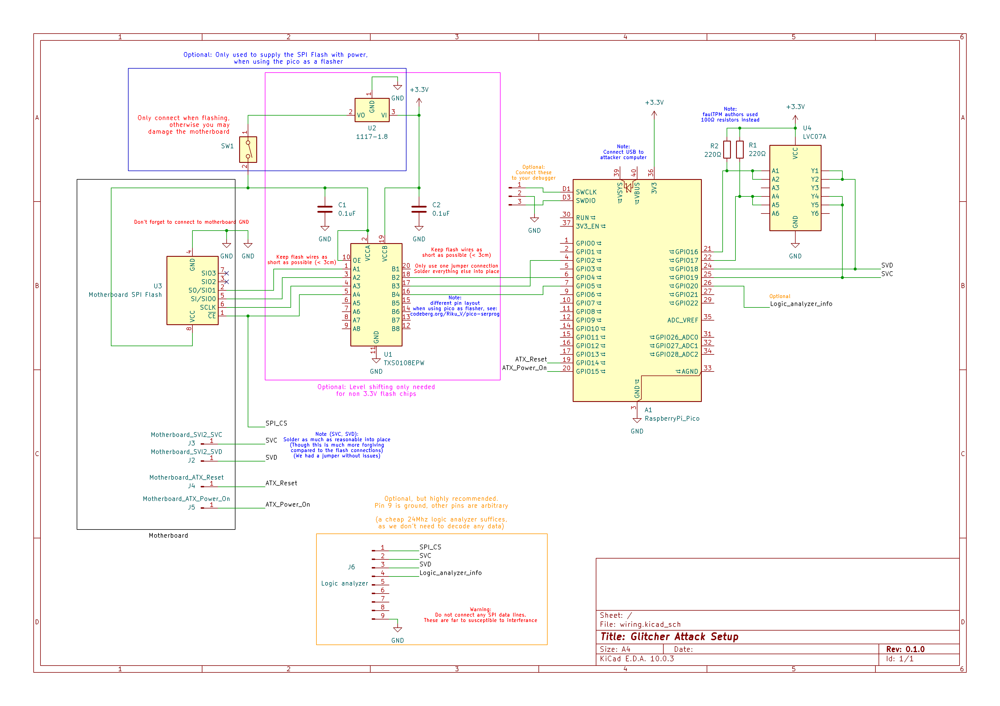

# Glitching firmware for the AMD SP

(currently only tested on a A520M-HVS & AMD Ryzen 3600)

# Contents

- [Wiring setup](#wiring-setup)
- [Parameter Determination](#parameter-determination)
- [Docs](#docs)
- [Building](#building)
  - [Pico firmware](#pico-firmware)
  - [Cli tool](#cli-tool)
  - [Helper scripts](#helper-scripts)
- [Tips & Tricks](#tips--tricks)

# Wiring setup



As pdf: [wiring pdf](./wiring/wiring.pdf)

# Parameter Determination

For the following I'd recommend you read both "faultpm: Exposing amd ftpms' deepest secrets" and "One glitch to rule them all: Fault injection attacks against amd's secure encrypted virtualization"

Use instructions from upstream: [parameter determination by PSPReverse](https://github.com/PSPReverse/amd-sp-glitch/blob/main/attack-code/ParameterDetermination.md)

I would recommend slight some slight variations:

1. Backup the SPI flash (important, as the ftpm secrets are stored there) e.g. using [pico-serprog](https://codeberg.org/Riku_V/pico-serprog)
2. Prepare the modified firmware:

- e.g. [hello world](https://github.com/PSPReverse/amd-sp-glitch/tree/main/payloads/hello-world) (Note it only outputs "H" due to a bug)
- Use [psptool](https://github.com/PSPReverse/PSPTool) to patch the firmware to create a modified SPI flash image

3. Flash the modified firmware
4. Determine the chip select count till ARK validation by using `glitcher count-chip-selects --reboot` (in our case 33)
5. Flash the original firmware
6. Use a few pulses (e.g. 31), use a low wait-duration and increase `dip-duration` till the target fully crashes. The target test range should end slightly before the target crashes. Test using `glitcher attack --chip-select-count <CHIP_SELECT_COUNT> --wait-duration-ns <WAIT_DURATION_NS> --dip-duration-ns <DIP_DURATION_NS> --spi-byte-count 2`
7. Use the logic analyzer to align the end of the second SVI2 packet injection shortly before the end of the validation window. If you have no logic analyzer, you will have to compensate by increaseing the wait-duration range to definitly hit the ark validation.
8. Refine params by setting the custom ranges in [determine-params](helpers/determine-params.py) and run. Now use the resulting values with [duration_test_plot](https://github.com/Nathan-Mossaad/amd-sp-glitch/blob/5e63abd1f0da41acaa2ef0fc65212f0690687d37/attack-code/duration_test_plot.py) to determine a smaller range, in accordance with "One glitch".
9. Flash the modified firmware
10. Start glitching using [extract-data](./helpers/extract-data.py) (see section [Helper scripts](#helper-scripts) for how to use [monitor.sh](./helpers/monitor.sh))

# Docs

Mostly missing, refer to `--help` of `glitcher` for now.

# Building

> [!NOTE]
> This project is only intended for use on Linux.

Install rustup & cargo:

[https://rust-lang.org/tools/install/](https://rust-lang.org/tools/install/)

## Pico firmware

Simple setup:

```bash
# Install pico specific target
rustup target add thumbv6m-none-eabi
# compile the firmware
cd glitcher-controller
cargo build -r
# Generating the uf2
cargo install elf2uf2-rs
elf2uf2-rs target/thumbv6m-none-eabi/release/glitcher-controller target/thumbv6m-none-eabi/release/glitcher-controller.uf2
# Now you can enter bootloader mode on the pico (by holding bootsel while plugging it in) and copy the uf2 file to it.
```

With debugging support:

You can use any [probe-rs](https://probe.rs/docs/getting-started/probe-setup/) compatible debugger, e.g. a PicoProbe (a second pico): [download](https://github.com/raspberrypi/debugprobe/releases) Wiring instructions: [wiring](https://mcuoneclipse.com/2022/09/17/picoprobe-using-the-raspberry-pi-pico-as-debug-probe/)

```bash
# Install pico specific target
rustup target add thumbv6m-none-eabi
# compile the firmware
cd glitcher-controller
# This will build, flash and then attach to the debug output of the pico
cargo run -r
```

## Cli tool

> [!NOTE]
> Make sure your user account belongs to the group that grants access to USB serial devices (for example, `dialout`).

Direct compile and run

```bash
# compile the cli tool
cd glitcher-cli
cargo run -r -- --help
# Check versions on different serial port
cargo run -r -- --port /dev/ttyACM1 check-version
```

Alternatively you may wish to add `glitcher` to your path and use e.g. `glitcher generate-completions zsh` to generate completions for your shell.

## Helper scripts

Managed via [uv](https://docs.astral.sh/uv/getting-started/installation/)

> [!NOTE]
> The main project needs to already run

```bash
# Direcly modify helpers/determine-params.py and helpers/flash-pico.py to your needs
cd helpers
mkdir results

# For param determination
uv run determine-params.py > "results/attack-$(date -Is).txt"
# Monitor the output via:
./monitor.sh
# Additionally get & print spi-tap data
uv run helpers/extract-data.py
```

# Tips & Tricks

Check that pico firmware version matches cli version

```bash
glitcher check-version
```

Almost instant shutdown (by killing power to the CPU :D)

```bash
glitcher disable-telemetry --reboot; glitcher set-vid 252
```

Power on

```bash
glitcher press-power-button --duration-ms 100
```

Count chip selects (mainly usefull with modified firmware for parameter determination)

```bash
glitcher count-chip-selects 3
```

Properly integrate glitcher into zsh with my [zsh setup](https://github.com/Nathan-Mossaad/zshrc)

```bash
cp glitcher-pc/target/release/glitcher ~/.local/bin/glitcher
glitcher generate-completions zsh > ~/.zfunc/_glitcher
# alias glitcher for a different port
echo 'alias glitcher="glitcher --port /dev/ttyACM1"' >> .zshrc
# Reload shell
```
